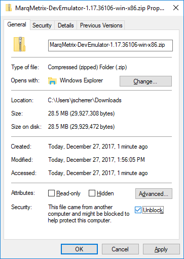
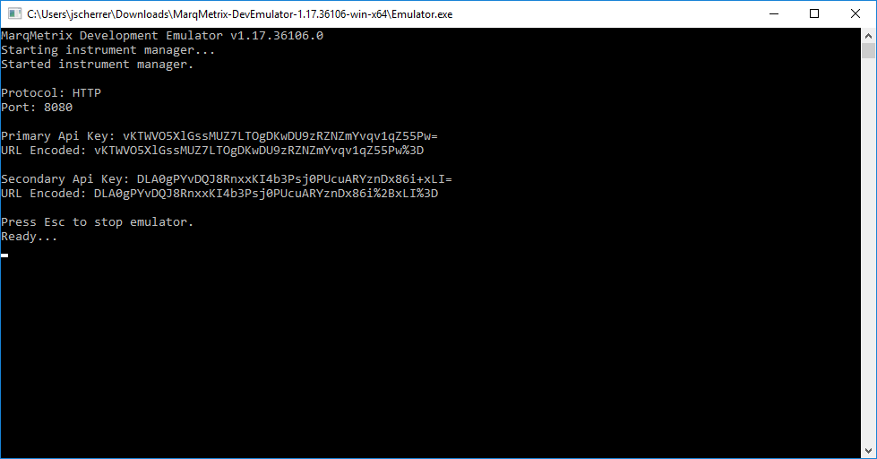

# Instrument Communication Samples
Languages that we currently have samples for:

- [C#](https://github.com/MarqMetrix/Samples/tree/master/Instrument%20Communications/CS)

### Development Emulators
Currently our emulators are only available as .zip packages. They are packaged with the .NET Core runtime libraries. So there is no dependency on any .NET frameworks.

**Instructions**

Before unzipping, you will need to Unblock the file.

1. Right-click the file, and click Properties.
2. Check "Unblock".

3. Click "Ok".

Then you can unzip the package to a location of your choice.

Make sure to run the emulator as Administrator. Either by right-clicking the executable, and selecting "Run as Administrator"; or by running the emulator from an Administrator elevated prompt, like Command Prompt or Powershell.

The executable is `emulator.exe` 

The emulator accepts the following arguments:

`-port`
The port number for the emulator to listen on.

`-sample`
The full path of the sample file to use during sample acquisition.

`-darksample`
The full path of the dark sample file to use during sample acquisition.

If a value isn't supplied for either argument, default values are supplied.

*The default port number is 8080. The default sample file is the SampleData.json included with the emulator.*

Once running, the emulator will display the primary and secondary API keys.

1. The primary/secondary key is used when calling from an SDK.
2. The URL encoded variants are for calling directly from a browser.

**Requirements:**

- Windows 7 or later (x64/x86)

**Versions:**

- [1.20.0.18297 Windows 64-bit](https://marqmetrixresources01.blob.core.windows.net/software/MarqMetrix-DevEmulator-1.20.0.18297-01-win-x64.zip)
- [1.20.0.18297 Windows 32-bit (x86)](https://marqmetrixresources01.blob.core.windows.net/software/MarqMetrix-DevEmulator-1.20.0.18297-01-win-x86.zip)
