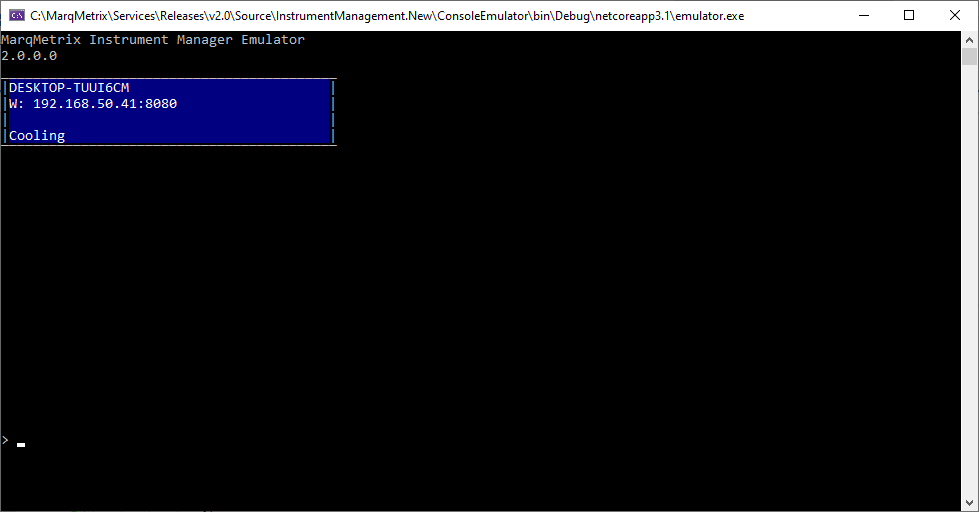
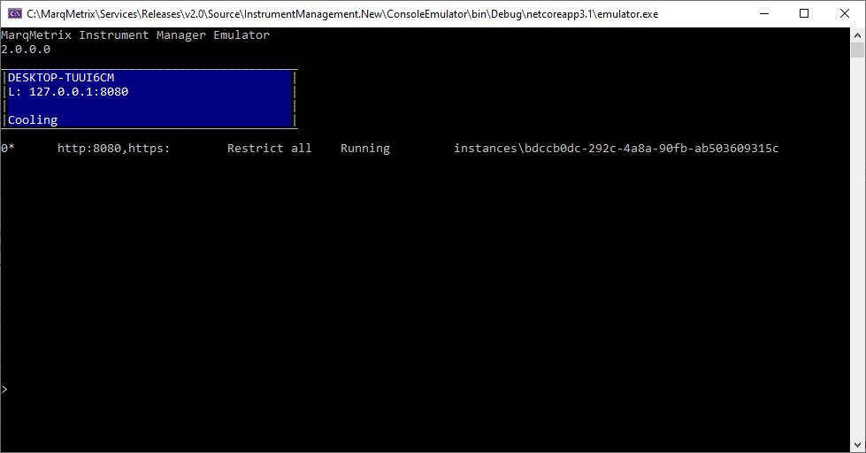
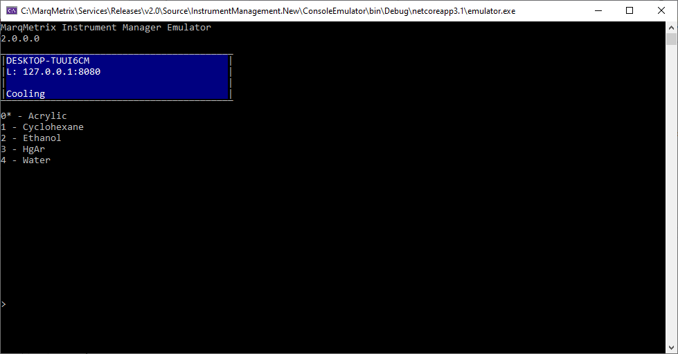
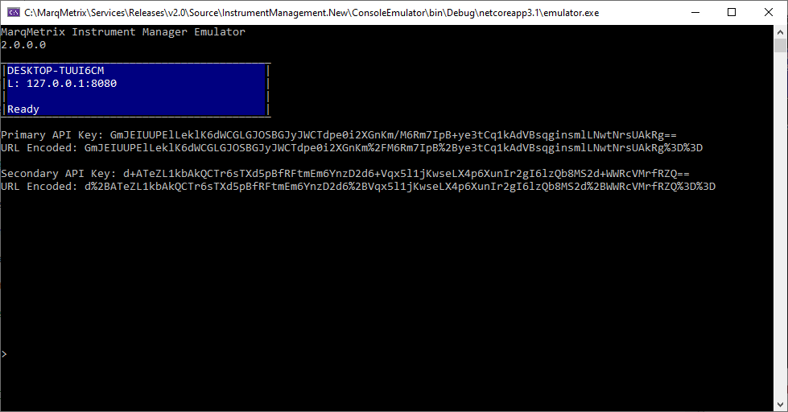

# Instrument Communication Samples
Languages that we currently have samples for:

- [C#](C%23)

### Development Emulator
Our emulator is available as a single executable.

**Requirements:**

- Windows 7 or later (x64/x86)

**Versions:**

- [2.0.0.20336 Windows 64-bit](https://marqmetrixresources01.blob.core.windows.net/software/Emulator/2.0.0.20336-09/win-x64/emulator.exe)
- [2.0.0.20336 Windows 32-bit (x86)](https://marqmetrixresources01.blob.core.windows.net/software/Emulator/2.0.0.20336-09/win-x64/emulator.exe)

**Instructions**

The executable is `emulator.exe`. The process it is emulating is the main service that runs on an actual device, called Instrument Manager (IM).

Download the `emulator.exe` to a folder where you want to keep it and it's associated state files. Either double-click the executable to run it, or run it from a command line.

When running, the emulator displays the equivalent of the front panel display for an actual device, with a command prompt at the bottom of the command window.

Having the ability to execute commands against the emulator enables the ability to change chemicals, start and stop IM, and even run multiple instances of IM.

There are two ways to begin using the emulator, auto and manual. In auto mode, the emulator detects if it is a first run and automatically sets up an instance of IM and starts it for you. In manual mode, nothing is setup and you are required to add instance(s), start IM, and add instrument(s) manually.

When the emulator first starts, it will be in a "Cooling" state for about 30 seconds. This is emulating what happens on an actual device.

**Auto mode**

To run the emulator in auto mode, run the following command with the associated options:

`start im auto`

`-http`
(Optional) The HTTP port number for the emulator to listen on. If no value is supplied, port 8080 is used.

**Manual mode**

To run the emulator in manual mode, just launch the executable. You will create an instance of IM, start that instance, and add an instrument to that instance. The steps of adding the instance, and the instrument to that instance only need to performed once.

To setup the emulator, the first step is to create an instance. This can be done by using the add instance command with the associated options:

`add instance`

`-http`
(Optional) The HTTP port number for the emulator to listen on.

Once the instance is created, you can start it with the following command:

`start im`

Once IM has been started, you can add the instrument by running the following command with the associated options:

`add instrument`

`-serial ########`
(Optional) The serial number to associate with the instrument. If no serial number is supplied, one is generated.

Once running, the command window should look like the following:

#### Other commands
##### List Instances

`list instances`

Lists all instances that exist within the emulator. An instance is the equivalent of a device at a network endpoint.

The instance number that is active has an asterisk (*) next to it. All commands being executed are done against the active instance.

##### List Instruments

`list instruments`

Lists the instruments that exist within the active instance. An instrument represents the probe and associated hardware for that probe.

##### List Samples

`list samples`

Lists the samples within the emulator that are used as references for sample acquisitions. Sample acquisition parameters like integration time and laser power are scaled from these references.

The sample that is active has an asterisk (*) next to it.

##### List Keys

`list keys`

Lists the API keys for communicating with the instrument. These should only be used for development purposes. When working with an actual instrument, the user should secure a connection by generating a short code.

##### Set Sample

`set sample <number>`

Sets the active sample to the one specified by the number. 

##### Stop IM

`stop im`

Stops the instance of instrument manager.

##### Exit

`exit`

Exits the emulator.