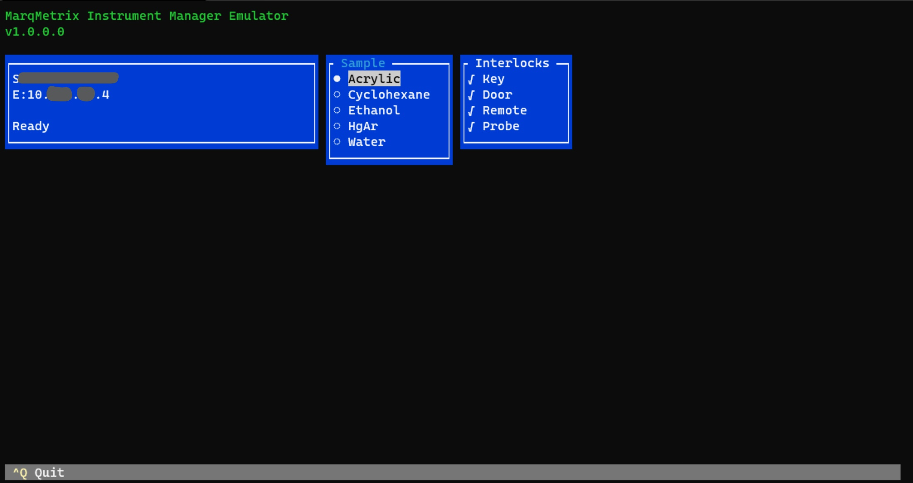

# Instrument Communication Samples
Languages that we currently have samples for:

- [C#](C%23)

## Development Emulator
Our emulator is available as a single executable.

**Requirements:**

- Windows 10 or later (x64/x86)

**Versions:**
- [2.0.5.0 Windows 64-bit](https://marqmetrixresources01.blob.core.windows.net/software/Emulator/2.0.5.0/win-x64/emulator.exe)
- [2.0.5.0 Windows 32-bit (x86)](https://marqmetrixresources01.blob.core.windows.net/software/Emulator/2.0.5.0/win-x64/emulator.exe)

---

## Instructions
The executable is `emulator.exe`. The process it is emulating is the main service that runs on an actual device, called Instrument Manager (IM).

Download the `emulator.exe` to a folder where you want to keep it and it's associated state files. Either double-click the executable to run it, or run it from a command line.

When running, the emulator displays the equivalent of the front panel display for an actual device, with a windows sections to control interlocks and sample types.

When the emulator first starts, it will be in a "Cooling" state for about 30 seconds. This is emulating what happens on an actual device.  

### Emulator Start Flags
Running emulator defaults the API port to 8080 and allowing remote connections to `true` (allows connections that come from a non `127.0.0.1` address).

These can be changed:
- `emulator.exe -httpPort 5000` Changes the API port to 5000.
- `emulator.exe -allowRemoteAccess false` Disables access to the API from a client not running on the same machine.  

### Set Interlocks
Shows the interlock status.  By clicking the check box it sets the interlock to true or false.  

### Set Sample
By clicking the radio buttion it sets the active sample returned by the emulator.  

### Exit
`ctrl+Q`

Exits the emulator.  Closing the console window will also exit the emulator.